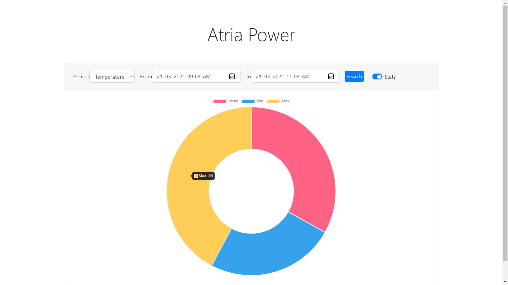

## Run
- `docker-compose up`
- http://localhost:80

## Add
- POST endpoint http://localhost:8001/api/add
- ```
  {
        "reading": 23.0, 
        "timestamp": 1616391452614, 
        "sensor_type": "temperature"	
  }

## Screenshots
### Table

### Graph with date range filter

### Table with date range filter

### Mean, Max, Min

### POST endpoint to Add new readings


